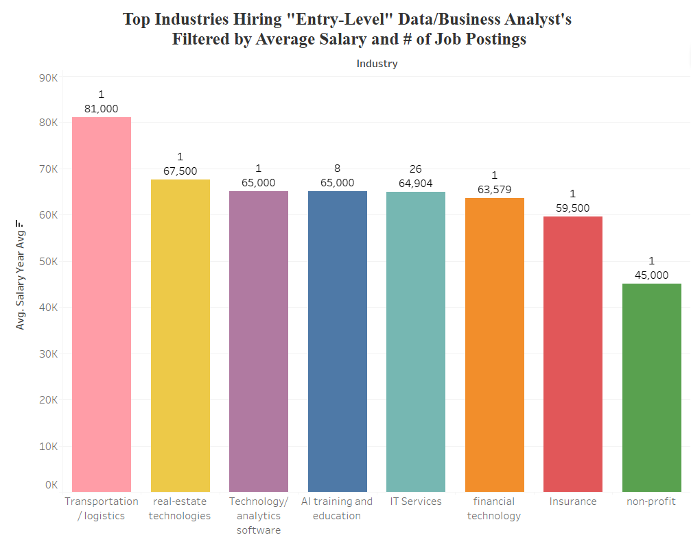
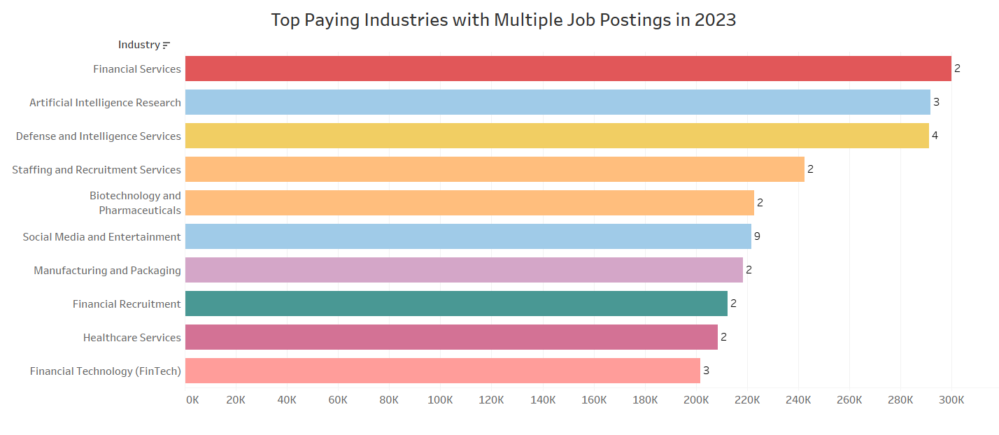
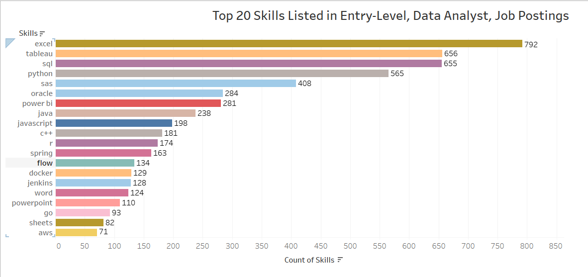
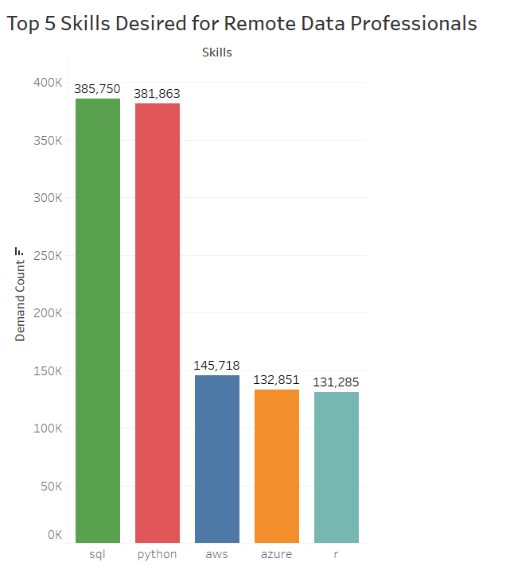
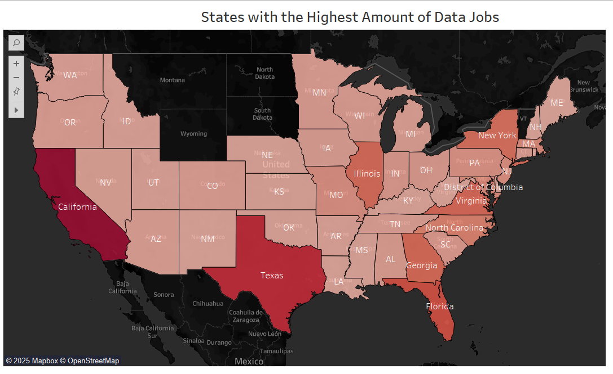
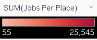
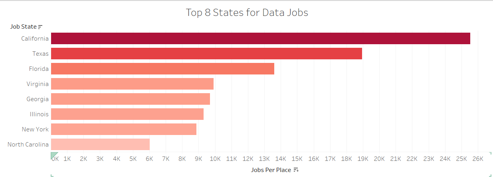
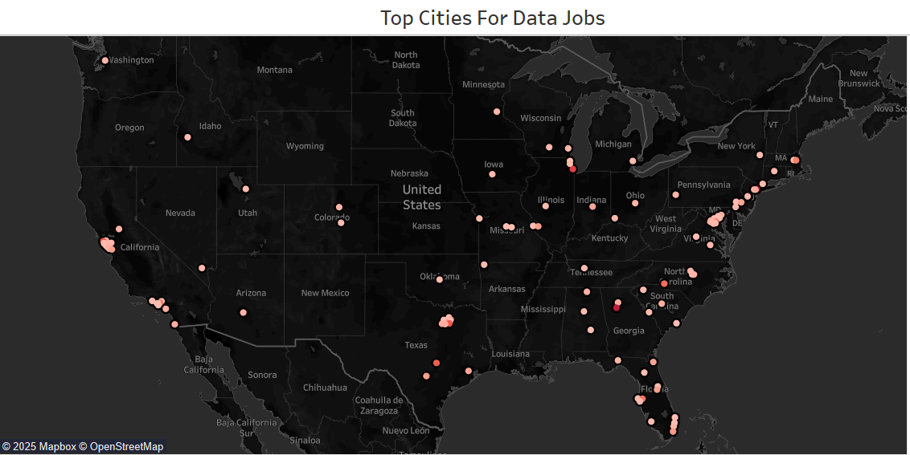
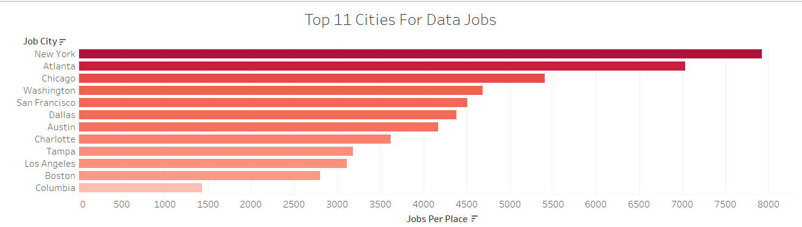

# Introduction
 Dive into the data job market! Focusing on "entry level" data/business analyst roles, this project explores what the most common industries that are hiring analysts are, the top skills wanted, and the best places to live for data jobs.

SQL Queries? Check them out here: [SQL_project](/SQL_Project/)
# Background
Driven by a quest to navigate the data job market more effectively, this project is my second full-length SQL project. The first being the Covid-19 SQL exploration located here: [SQL_COVID_Project_#1](https://public.tableau.com/app/profile/patrick.lutz/viz/CovidDashboard1_16859910334760/Dashboard1). 

# Tools I used
- **SQL**: The backbone of my analysis, allowing me to query the database and unearth critical insights
- **PostgresSQL**:The Chosen database management system
- **Visual Studio Code**: My go-to for database management and executing SQL queries
- **Git & GitHub**: Essential for version control and sharing my SQL scripts and analysis, ensuring collaboration and project tracking.
- **Excel**: For exported SQL query CSV files, I used simple data analysis and visualization techniques in Excel to help complete my graphs and visualizations
- **Tableau**: For the building of visualizations and two final dashbaords showcasing my main insights
- **ChatGPT**: For miscellaneous assistance in building graphs and visualizations

This project marks the first time I've used postgreSQL and Visual Studio Code which allowed me to gain valuable skills in database management, SQL querying, and project management. I've used git/github before but this course really helped me understand how to more effectively use Github for showcasing and publishing projects, as well as, version contol and setting myself up for potential collaboration. Additionally, by using Excel, Tableau and chatGPT for help in creating data visualizations, I was able to see the potential of a data analytics tech stack. Overall this project allowed me to better understand the process and evolution of a data analytics capstone project

Data hails from [Luke Barrousse's SQL Course](https://www.youtube.com/watch?v=7mz73uXD9DA&t=14297s). It's packed with data on data analyst job titles, salaries, locations, companies, job postings, and skills.

### The questions I wanted to answer through my SQL queries were:
1. What industries hire the most entry-level data analysts and whats the avg salary per industry?
2. What industries hire the highest paid data analysts and whats the avg salary per industry?
3. What are the top skills desired for entry-level data analysts
4. WHat are the top skills for any data professional, from analysts to engineers?
5. What states and cities have the most data analyst job postings?

# The Analysis
Each query for this project is aimed at analyzing specific aspects of the data analytics job market. Here's how I approached each question:

### 1. Common Industries hiring "Entry-Level" Data/Business Analysts

To see what industries are hiring the most entry-level data analysts, I filtered my data to focus on job postings that included the key word "entry-level" or "junior". I also filtered specifically for "data/business analysts". Additionally, I wanted to keep the job postings located in the U.S., where I reside, focusing on "full-time' positions that included the average yearly salary.

```sql
Select
  job_title,
  job_title_short,
  job_location,
  job_schedule_type,
  job_country,
  salary_year_avg,
  name as company_name
FROM 
  job_postings_fact
LEFT JOIN company_dim ON job_postings_fact.company_id = company_dim.company_id
WHERE 
    (job_title_short = 'Data Analyst'  OR
     job_title_short = 'Business Analyst') 
  and (job_title LIKE '%Entry_Level%' 
    OR job_title LIKE '%junior%')
   AND Salary_year_avg IS NOT NULL 
   AND job_schedule_type = 'Full-time'
    AND job_country = 'United States'
ORDER BY 
  Salary_year_avg DESC
;
```

 

Insights from the "Top Industries Hiring Entry-Level Data Analyst"

**-Diverse Industries:** The main industries hiring entry level data analyst's are:
1. Transportation/logistics
2. Real-estate tech
3. Software
4. AI education
5. IT Services
6. fintech
7. Insurance
8. Non-profit

**-IT Services hire the most entry-level analysts with 26 job postings:** For aspiring data analysts, an entry-level job at an IT company is probably the best way to get ones foot in the door.

**-Wide Salary Range:** The salary range for entry level analyst's spans $45,000 to $81,000 with the average "entry-level" analyst role paying around $64,000

**-Transportation/Logistics pays entry-level analysts the most with an $81,000 average annual salary** If an aspiring data analyst is trying to maximize their earnings quickly, then aiming their job search to logistics companies is a solid way to do so. 


### 2. The "Highest Paying" Industries Hiring Data Analyst's in 2023 Filtered by Salary and Number of Job Postings
For the second query I wanted to see what industries are hiring the highest paid data analyst's and how that differs from industries hiring entry-level data analysts. So I filtered for "data/business analysts",located in the U.S., where I reside, focusing on "full-time' positions that included the average yearly salary. Then I looked at the top 50, highest paying analyst job postings. 

From there, I exported this sub-dataset to Excel where I used ChatGPT to research and assign an industry based on each company in this dataset. 

Finally, I uploaded this newly updated dataset to Tableau where I created my bar graph visualization. I focused on industries that had more than one job posting.

```sql
Select
  job_title,
  job_title_short,
  job_location,
  job_schedule_type,
  job_country,
  salary_year_avg,
  name as company_name
FROM 
  job_postings_fact
LEFT JOIN company_dim ON job_postings_fact.company_id = company_dim.company_id
WHERE 
     (job_title_short = 'Data Analyst' 
    OR job_title_short = 'Business Analyst')
   AND Salary_year_avg IS NOT NULL 
   AND job_schedule_type = 'Full-time'
   AND job_country = 'United States'
ORDER BY 
  Salary_year_avg DESC
  LIMIT 50
;
```
 

Insights from the "Top Paying Industries with Multiple Job Postings"

**Top Data Analytics jobs offer diverse industries to work in** From fintech to AI to social media and entertainment to healthcare, Data anaylst jobs are needed in a wide range of jobs, making it a fairly safe career choice today and in the future.

**-Social Media and Entertainment hire the most entry-level analysts with 9 job postings:** This includes companies like Meta, Netflix, and Instagram. If you want a top paying, highly in demand data analyst job, specializing in Social media and probably marketing analytics is a solid investment.

 **-Financial Services(i.e. Fintech) has the second highest amount of job postings with 7 job postings** Turns out finance and the financial tech spheres are great industries for data analyst to focus their job search on.

**-High Salary Range:** The salary range for top paying analyst roles is high! It spans $200,000 to $300,000 with the average top paying analyst role paying around $241,086


### 3. Top 20 Entry-Level, Data Analyst Skills Listed in Job Postings
For the third query, I wanted to see what were the most desired skills from entry-level/junior analyst's. By using my previous query that looked at Entry level jobs and industries, I was able to join the skills table which then allowed me to see every skill that is associated with each job posting. Later on, in Tableau I was able to group by skill and and then visualize these skills by how often they were listed in job postings.

```sql
WITH entry_us_jobs AS (
Select
  job_id,
  job_title,
  job_title_short,
  job_location,
  job_schedule_type,
  job_country,
  salary_year_avg,
  name as company_name
FROM 
  job_postings_fact
LEFT JOIN company_dim ON job_postings_fact.company_id = company_dim.company_id
WHERE 
   (Job_country = 'United States' AND
   job_title LIKE '%Analyst%') AND
  (job_title LIKE '%Entry_Level%' OR
  job_title LIKE '%Junior%')
ORDER BY 
  Salary_year_avg DESC
)

SELECT 
  entry_us_jobs.*,
  skills
FROM entry_us_jobs
INNER JOIN skills_job_dim ON entry_us_jobs.job_id = skills_job_dim.job_id
INNER JOIN skills_dim ON skills_job_dim.skill_id = skills_dim.skill_id
ORDER BY salary_year_avg DESC;
```



Insights from the "Top 20 Entry-Level, Data Analyst Skills Listed in Job Postings"

**-Excel is the most sought after skill for entry-level analyst's** For aspiring data analyst, focus on Excel first and foremost

**-Tableau and SQL are tied for the second most sought after skill** Listed in over 650 entry-level job postings, Tableau and SQL are vital for an entry-level data analyst

**-The best entry-level data analyst skill stack is to be adept at Excel, Tableau, SQL, Python, SAS; in that order.**

### 4. Top 5 Skills to for any Data Professional Job
To contrast this last visualization, I wanted to see what the top five skills desired are for any data professional, from analysts to engineers. I filtered for remote jobs since remote work seems to be more desired amoung data professionals and personally I would prefer to work remotely.

```sql
SELECT 
    skills,
    COUNT(skills_job_dim.job_id) AS demand_count
FROM job_postings_fact
INNER JOIN skills_job_dim ON job_postings_fact.job_id = skills_job_dim.job_id
INNER JOIN skills_dim ON skills_job_dim.skill_id = skills_dim.skill_id
GROUP BY skills
ORDER BY demand_count DESC
limit 5;
```


Insights from the "Top 5 Skills for Remote Data Professionals"

**-SQL and Python are highly sought after skills for all data professionals, whether entry-level or seasoned professionals**

**-Having some knowledge and experience with cloud computing software like AWS or Azure would be beneficial to any data professional**

**-R is a very sought after skill for experienced data professionals**

### 4. Top Cities and States in the U.S. for Data Analyst Jobs
Even if remote jobs largely dominate the data job market, as an entry-level analyst, I felt like it's still very beneficial to network in person. Therefore knowing what states and cities in the U.S. have the most data jobs was important information to find out. 

To accomplish these graphs and maps, I simply counted the number of job postings per city. Then I exported that dataset over to Excel where I separated the city and state. Finally in Tableau, I used that new Excel dataset to aggregate the amount of jobs by city and state, visualizing the states and cities with the most job postings.

```sql
SELECT 
    job_location,
    COUNT(*) AS Jobs_per_place
FROM job_postings_fact
WHERE job_country = 'United States'
    AND job_location <> 'United States' 
    AND job_location <> 'Anywhere'
GROUP BY job_location
Order BY
    jobs_per_place DESC;
```








Insights from the "Top Cities and States in the U.S. for Data Jobs"

**-The top three states with the highest number of data analyst jobs are California, Texas and Florida.**

**-My homestate of Tennessee is not one of the top states for data jobs. However there are quite a few states close by in the southeast region that do have substantial amounts of data jobs listed:**
-Virginia
-Georgia
-North Carolina
-Florida

**-The top states 3 cities for data jobs are New York, Atlanta, and Chicago. Most of the big cities in the U.S. make this list from L.A. to Seattle to Boston to Denver.**

**-The interactive map published in Tableau Public shows that many smaller, medium sized cities have large concentrations of data jobs.** For instance: Alphareta, GA, Bentonville, AR, Charleston, SC, Colorado Springs, CO. (Personally, I love medium sized cities so I would be more inclined to seek out cool, outdoorsy, medium sized cities for a data job)

# What I Learned
Throughout this adventure, I learned a lot about how to create and publish a data analytics project to my portfolio. 

🧩Modern Data Tech Stack: I learned how to navigate databases like postgreSQL, using IDE's to communicate with those databases,and using various data tech tools like Excel, Tableau and ChatGPT to create beautiful visualizations

📊 Complex SQL Analysis: Utilizing advanced SQL coding, I implemented the use of JOIN's, Temp tables and CTE's, filtering my datasets and aggregating them to find data-driven insights and answers


# Conclusions

From the analysis, several general insights emerged:

**Diverse Industries:** Data analytics offers a wide range of industries to work in. Whether you want to focus on general IT, healthcare, social media, AI, fintech, insurance, or non-profits, data analytics jobs are needed in almost every major industry. 

**In demand skills:** This project basically reinforced and reiterated the idea that the classic data tech stack of Excel, SQL and Tableau are the best skills to become skilled in for entry-level and experienced analysts alike. After that, Python, SAS, R and some cloud computing software like AWS or Azure are solid skills to invest in. 

**Medium to large Cities offer the best opportunities for data jobs:** Basically, being located in close proximity to a large city gives an entry-level analyst the best prospects for jobs. The three best states to live in for data analytics are California, texas and Florida and the three best cities are New York, Atlanta, and chicago.


Closing Thoughts

This project enhanced my SQL skills exponentially and provided valuable insights into the data analyst job market. Not only does this project showcase my own skills with SQL, Excel, Tableau, and ChatGPT, it also serves as a guide for my own data job search. This allows me to focus my data job search to specific industries that I know are in high demand of analysts. The project demonstrates that aspiring data analysts should double down on the classic data skills of Excel, SQL, and Tableau, while also learning new and diverse technologies like AI, python or cloud computing. I learned that real data analysis mostly involves getting stuff done. Using whatever tools you have available to compile and clean the data, visualize and uncover data-driven insights, and showcase findings in clear and concise ways to stakeholders. This exploration highlights the importance of continuous learning and adaptation to emerging trends in the field of data analytics.